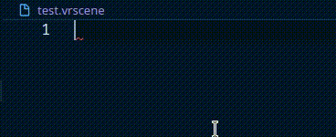

# vrscene-syntax-highlight README

vrscene-syntax-highlight adds syntax highlighting for Chaos'
vrscene files.

Initial syntax file taken from
[Aloiseau/VraySublime](https://github.com/Aloiseau/VraySublime)

## Features

## Known Issues

* Some property values are misinterpreted as keys.
* Some plugin names and properties are missing.
* Auto-completion is not context-aware (i.e. it does not
  know which properties are supported for each plugin).